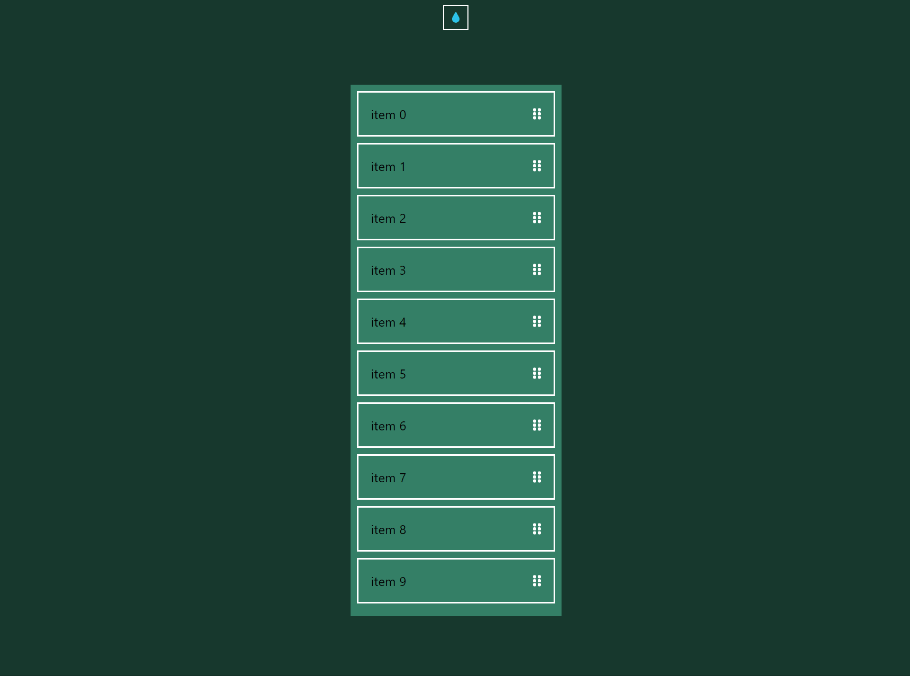
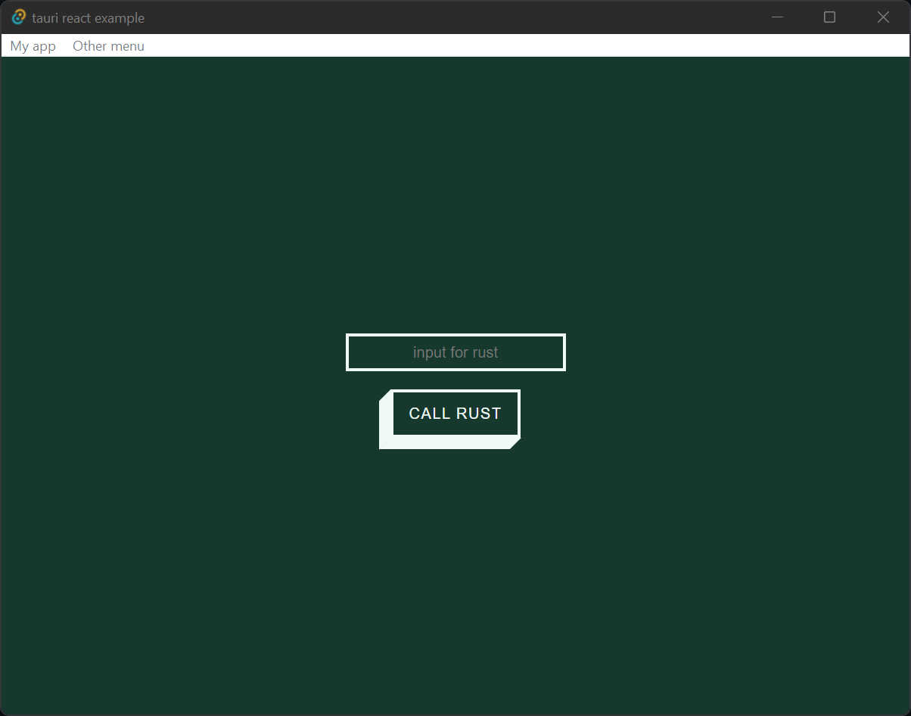

## Tauri React Example (2022)

> recently updated with the latest versions of tauri (feat. drag n drop functionality)





Simple [React](https://create-react-app.dev/)([vite](https://vitejs.dev/)) starter running with [Tauri](https://tauri.studio/).

Should hopefully save some time trying to setup Tauri and React.

Includes `react-beautiful-dnd` with the `"fileDropEnabled": false` options set in `tauri.config.json`. This can be removed if you don't require it.

> Currently config'd to run on the [Cloudbridge](https://tauri.studio/docs/architecture/recipes/cloudbridge) pattern.

### Development

```
yarn tauri dev
```

### Production Build

```
yarn tauri build
```


## Debugging on Windows

Install [Microsoft Edge Devtools](https://www.microsoft.com/en-au/p/microsoft-edge-devtools-preview/9mzbfrmz0mnj?rtc=1&activetab=pivot:overviewtab). Make sure you have Edge Legacy installed.

more info [here](https://github.com/tauri-apps/tauri/wiki/04.-MS-Windows-Setup#devtools)
