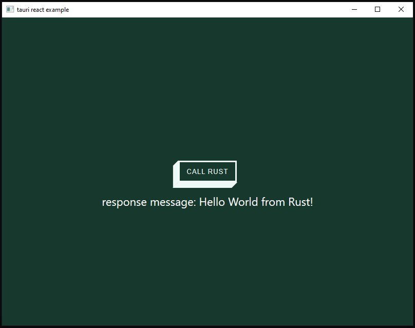

## Tauri React Example



Simple [CRA](https://create-react-app.dev/) starter running with [Tauri](https://tauri.studio/).

Should hopefully save some time trying to setup Tauri and React.

> Currently config'd to run on the [Cloudbridge](https://tauri.studio/docs/usage/patterns/cloudbridge) pattern.

### Development

```
yarn dev
```

### Production

```
yarn tauri:build
```

## Debugging on Windows

Install [Microsoft Edge Devtools](https://www.microsoft.com/en-au/p/microsoft-edge-devtools-preview/9mzbfrmz0mnj?rtc=1&activetab=pivot:overviewtab). Make sure you have Edge Legacy installed.

more info [here](https://github.com/tauri-apps/tauri/wiki/04.-MS-Windows-Setup#devtools)
